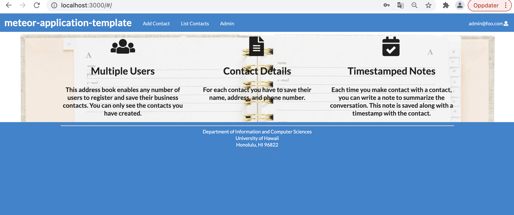

Digits is an app that allows users to create and manage contacts, as well as adding notes regarding interactions with contacts.


## Installation

First, [install Meteor](https://www.meteor.com/install).

Second, go to [https://github.com/heleeha/digits](https://github.com/heleeha/digits), and download a copy of this repo.

Third, cd into app and install meteor

```
$ meteor npm install
```

## Running the system

Run the app by running this command

```
$ meteor npm run start
```

The first time the app is ran, it will create some default users and contacts. Here is the output:

```
meteor npm run start

> meteor-application-template-react@ start /Users/helenehaugen/Dokumenter-mac/Hawaii_semester_7/ics314/digits/app
> meteor --no-release-check --exclude-archs web.browser.legacy,web.cordova --settings ../config/settings.development.json

[[[[[ ~/Dokumenter-mac/Hawaii_semester_7/ics314/digits/app ]]]]]

=> Started proxy.                             
=> Started MongoDB.                           
I20211109-11:39:54.382(-10)? Creating the default user(s)
I20211109-11:39:54.418(-10)?   Creating user admin@foo.com.
I20211109-11:39:54.482(-10)?   Creating user john@foo.com.
I20211109-11:39:54.611(-10)? Creating default contact.
I20211109-11:39:54.637(-10)?   Adding: Johnson (john@foo.com)
I20211109-11:39:54.729(-10)?   Adding: Casanova (john@foo.com)
I20211109-11:39:54.731(-10)?   Adding: Binsted (admin@foo.com)
I20211109-11:39:54.842(-10)? Monti APM: completed instrumenting the app
=> Started your app.

=> App running at: http://localhost:3000/
=> Started your app.
```

You can run Eslint by running this command.
```
$ meteor npm run lint
```

## Walkthrough

#### Landing page

When you go to http://localhost:3000, this is the landing page that should be displayed:


The next step is to log in by clicking Login in the top menu. You can either register a new account or Login to an existing account.

#### Login page

When clicking on the Login link and choosing "Sign in" in the top menu you get to this page:


#### Register page

Or clicking on the Login link and then choosing the "Sign Up" in the menu, displays this page:


#### Landing (after Login) page, non-Admin user

Once you log in (either to an existing account or by creating a new one), the navbar changes as follows:


You can now add new Stuff documents, and list the Stuff you have created. Note you cannot see any Stuff created by other users.

#### Add Contact page

After logging in,you can add new contacts on this page:


#### List Contact page

After logging in, you can also list your own contacts on this page:


You click on "Edit" on each contact to go to Edit Contact page.

#### Edit Contact page

After clicking "Edit" on a contact, you to change and save it on this page:


#### Landing (after Login), Admin user

You can define an admin user in the settings.json file. This user gets a special entry in their navbar:



#### Admin page

Admin users can see all contacts and the owner of each contact when they go to the admin page shown below:


